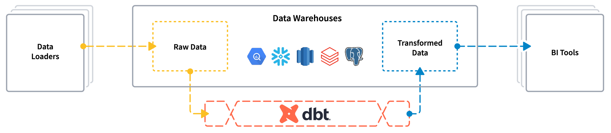
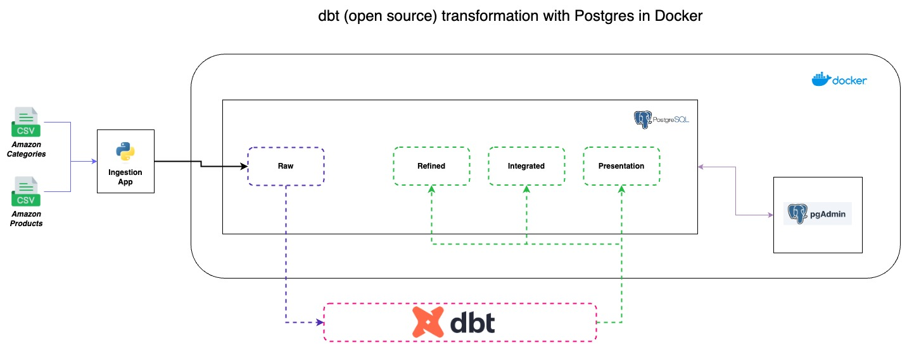
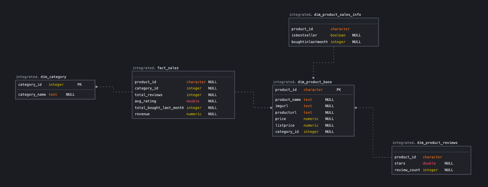
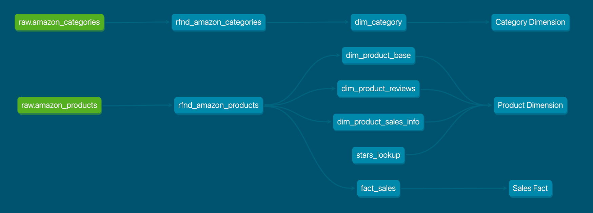

# dbt transformation (open source) with Postgres in Docker

<p align="center">
  
</p>



This project demonstrates an end-to-end data pipeline using open source **[dbt](https://github.com/dbt-labs/dbt-core)** for transformations with data stored in a PostgreSQL database managed by Docker. The process includes ingestion from Kaggle, raw data storage in Postgres, and transformation using dbt.




## Data Model



## Directory Structure:

```
├── data: Contains source data files and data source URLs
├── dbt_transform: Houses dbt related configurations, models, tests, and more
│   ├── analyses: Contains analytical SQL queries for ad-hoc analysis.
│   ├── dbt_packages: Dbt's package dependencies for the project.
│   ├── logs: Stores log files generated during dbt runs.
│   ├── macros: Contains custom dbt macro definitions.
│   ├── models: Contains the main SQL models which define transformations.
│   ├── seeds: Holds seed files, which allow you to load static data into your warehouse.
│   ├── snapshots: Manages changes in your data over time.
│   ├── target: Stores compiled SQL code and other artifacts from dbt runs.
│   └── tests: Stores test definitions for dbt models.
├── Ingestion: Contains SQL scripts for data ingestion.
└── docker-compose.yml: Docker compose file for setting up Postgres and pgAdmin
```

### **Python Virtual Environment Setup**:

Before you proceed, set up a Python virtual environment:
- Navigate to the project root directory.
- Run `python -m venv dbt-venv` to create a new virtual environment.
- Activate the virtual environment with `source dbt-venv/bin/activate` (Linux/macOS) or `dbt-venv\Scripts\activate` (Windows).
- Install the required packages with `pip install -r requirements.txt`.

## Setup:

1. **Data Ingestion from Kaggle**:
    - Download data from the URL mentioned in the `data/data_source.txt` file.
    - CSV files will be stored in the `data` directory.

2. **Database Setup with Docker**:
    - Run `docker-compose up -d` to start the Postgres and pgAdmin containers.
    - Access pgAdmin at `http://localhost:8088` using credentials: `admin@domain.com` / `admin`.
    - Connect pgAdmin to the Postgres instance using credentials: `user` / `password` and host `postgres`.

3. **Database Ingestion**:
    - Use the DDLs found in the `Ingestion/ddls` directory to create the necessary tables in the `raw` schema of the PostgreSQL database.
    - Ingest CSV files from the `data` directory into the corresponding tables.

4. **DBT Transformation**:
    - Navigate to the `dbt_transform` directory.
    - Ensure dbt is installed and run `dbt deps` to install any dbt packages.
    - Run `dbt run` to execute the dbt models.
    - (Optional) Run `dbt test` to execute tests on the dbt models.

5. **DBT Documentation**:
    - In the `dbt_transform` directory, run `dbt docs generate` to build the documentation site.
    - After generating, run `dbt docs serve` to start a local server.
    - Open a web browser and navigate to the URL provided (usually `http://localhost:8080`) to view the dbt documentation, including model lineage (as below), column descriptions, and more.

    

6. **Exploration**:
    - Use pgAdmin or any SQL client to query and explore the transformed data in Postgres.

## DBT Commands Guide

### Running dbt Models:

#### Run all models:
```sh
dbt run
```  
### Run a specific model inside a directory:
```sh
dbt run --model integrated.dim_product_base
```
### Run a specific model and all of its upstream models:
```sh
dbt run --model +integrated.dim_product_base
```
### Run a specific model and all of its downstream models:
```sh
dbt run --model integrated.dim_product_base+
```
### Run all models within a directory:
```sh
dbt run --model integrated.*
```
### Exclude a specific model inside a directory:
```sh
dbt run --exclude integrated.dim_product_base
```
### Run models based on Tag
```sh
dbt run --model tag:DIM
```

## Testing dbt Models:

### Run tests on all models:
```sh
dbt test
```
### Run tests on a specific model inside a directory:
```sh
dbt test --model integrated.dim_product_base
```
### Run tests on a specific model and all of its upstream models:
```sh
dbt test --model +integrated.dim_product_base
```
### Run tests on a specific model and all of its downstream models:
```sh
dbt test --model integrated.dim_product_base+
```
### Run tests on all models within a directory:
```sh
dbt test --model integrated.*
```
### Exclude tests for a specific model inside a directory:
```sh
dbt test --exclude integrated.dim_product_base
```
### Run tests based on Tag
```sh
dbt test --model tag:DIM
```

## Click below for some common dbt commands

**[Common dbt Commands](https://docs.getdbt.com/reference/dbt-commands#available-commands)**

## Click below for other dbt Packages

**[dbt Packages](https://hub.getdbt.com/)**

## 🎓 Learning DBT with this Project

This project is designed as a learning resource for those new to dbt. Here's how to get the most out of it:

### Additional Learning Resources

- **[LEARNING_PATH.md](./LEARNING_PATH.md)**: A step-by-step guide for beginners to work through this project
- **[DBT_GLOSSARY.md](./DBT_GLOSSARY.md)**: Definitions of key dbt terms and concepts used in this project
- **[EXERCISES.md](./EXERCISES.md)**: Hands-on exercises to practice dbt concepts
- **[DATA_FLOW.md](./DATA_FLOW.md)**: Visual representation of the data transformation pipeline

### Getting Started for GitHub Users

1. **Clone this repository**:
   ```bash
   git clone https://github.com/YOUR_USERNAME/dbt-core-transform.git
   cd dbt-core-transform
   ```

2. **Set up your environment**:
   - Follow the Python Virtual Environment Setup section above
   - Start Docker containers with `docker-compose up -d`
   - Configure your profiles.yml file (use the provided example as a template)

3. **Follow the learning path**:
   - Start with the LEARNING_PATH.md document
   - Review the DATA_FLOW.md to understand the architecture
   - Complete exercises in EXERCISES.md to practice concepts

4. **Join the Community**:
   - [dbt Community Slack](https://community.getdbt.com/)
   - [dbt Discourse Forum](https://discourse.getdbt.com/)
   - [dbt Learn Resources](https://courses.getdbt.com/collections)

Happy learning!